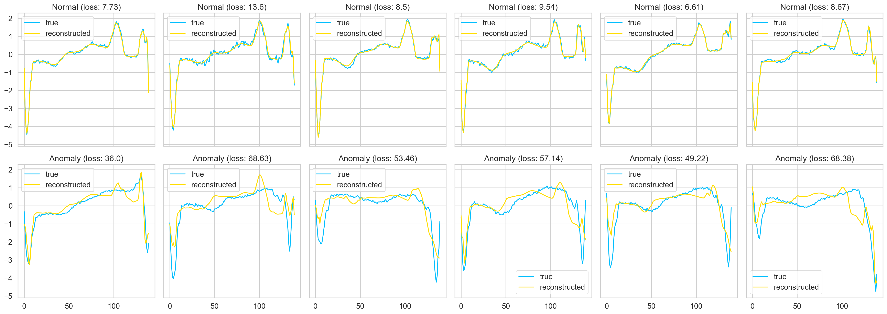

# ECG-LSTM-Autoencoders
ECG (Electrocardiogram) is a medical diagnostic tool used to measure and record the electrical activity of the heart over a period of time. Analyzing ECG data is crucial for diagnosing various heart conditions and abnormalities. LSTM (Long Short-Term Memory) autoencoders are a type of neural network architecture used for sequence-to-sequence data, and they can be applied to ECG data for specific tasks.

Here's a brief description of using LSTM autoencoders for ECG data:

1. **ECG Data**:
   - The dataset contains 5000 Time Series examples (obtained with ECG with 140 timesteps). Each sequence corresponds to a single heartbeat from a single patient with congestive            heart failure.
   - We have 5 types of heartbeats(classes):
      * Normal (N)
      * Premature Ventricular Contraction (PVC)
      * R-on-T Premature Ventricular Contraction (R-on-T PVC)
      * Supra-ventricular Premature or Ectopic Beat (SP or EB)
      * Unclassified Beat (UB).

3. **Autoencoders**:
   - Autoencoders are a type of neural network architecture used for unsupervised learning. They consist of an encoder and a decoder.
   - The encoder compresses the input data into a lower-dimensional representation (encoding) and the decoder attempts to reconstruct the original input from this encoding.
   - Autoencoders are often used for dimensionality reduction, denoising, and feature learning.

4. **LSTM Autoencoders for ECG**:
   - LSTM autoencoders are a variant of autoencoders that use Long Short-Term Memory cells to handle sequential data.
   - When applied to ECG data, LSTM autoencoders can learn to capture temporal dependencies and patterns within the ECG signal.
   - The encoder LSTM layer processes the ECG time series data and generates a compressed representation of the signal.
   - The decoder LSTM layer then attempts to reconstruct the original ECG signal from this compressed representation.
     
5. Results
   

In summary, LSTM autoencoders can be a valuable tool for analyzing ECG data, particularly for denoising, anomaly detection, and feature extraction tasks. Their ability to capture temporal dependencies in sequential data makes them well-suited for processing ECG time series data and aiding in the diagnosis and monitoring of heart conditions.
